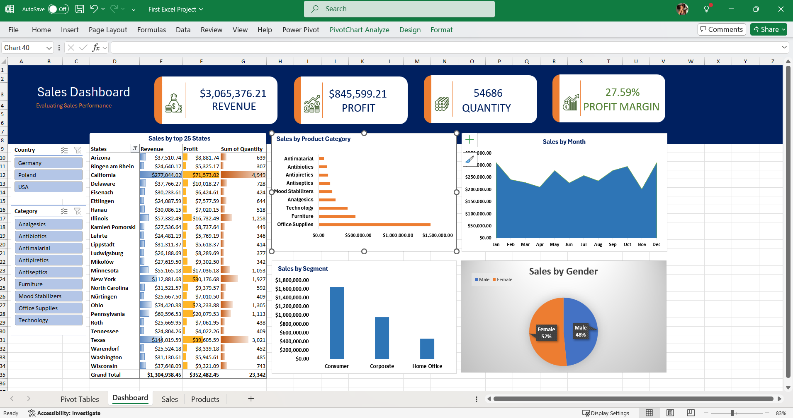

# Project 1

**Title:** [LonderMart](LondonMart.xlsx)

**Tools Used:**

**Project Description:**

**Key findings**

**Dashboard Overview:**

# Project 2

**Title:** HR People Data

**SQL Code:**[HR_Data-Data interogation and manipulation] (https://github.com/JOO-Obuku/JOObuku.github.io/blob/main/HR_Data.sql)

**SQL Skills Used:**
Data retrieval(SELECT): Queried and extracted specific information from the database

Data aggregation(SUM, COUNT): Calculated totals. such as sale and qaumtities...

Data Filtering(HWERE, BETWEEN, IN AND): Applied filterd to select relevant data, including filtering by ranges and lists.

Data source Specification (FROM): Specified the tables used as data sources for retrieval

**Project description**

**Technology used:** SQL sever

